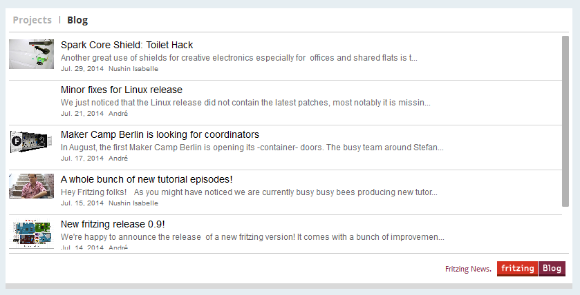
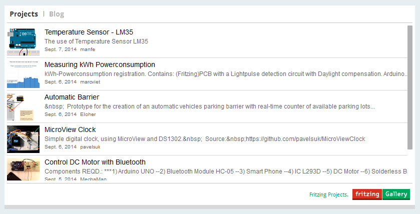
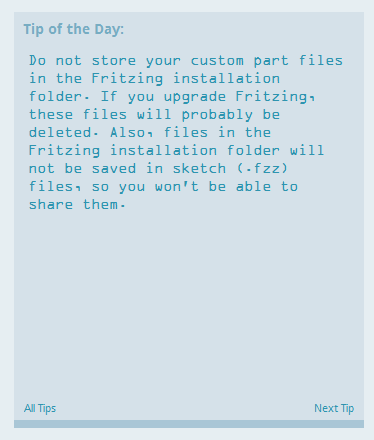

## Welcomeview ##

1. Information and Updates
	
	The welcomeview offers a window into the makerworld. we provide you with updates from the blog and the community.
	

2. Projectgallery
	
	The project-section show you the latest updates from the community. You can find inspiration and allready made openHardware projets from other fritzing users.
  	

3. recent file handeling
	
	The Recent-file frame shows a list of your last projects. so you can easily rejoin your last work.
	

4. Tips & Tricks

	This section provides you randomly with usefull tips and tricks for a better handling of fritzing.
    

