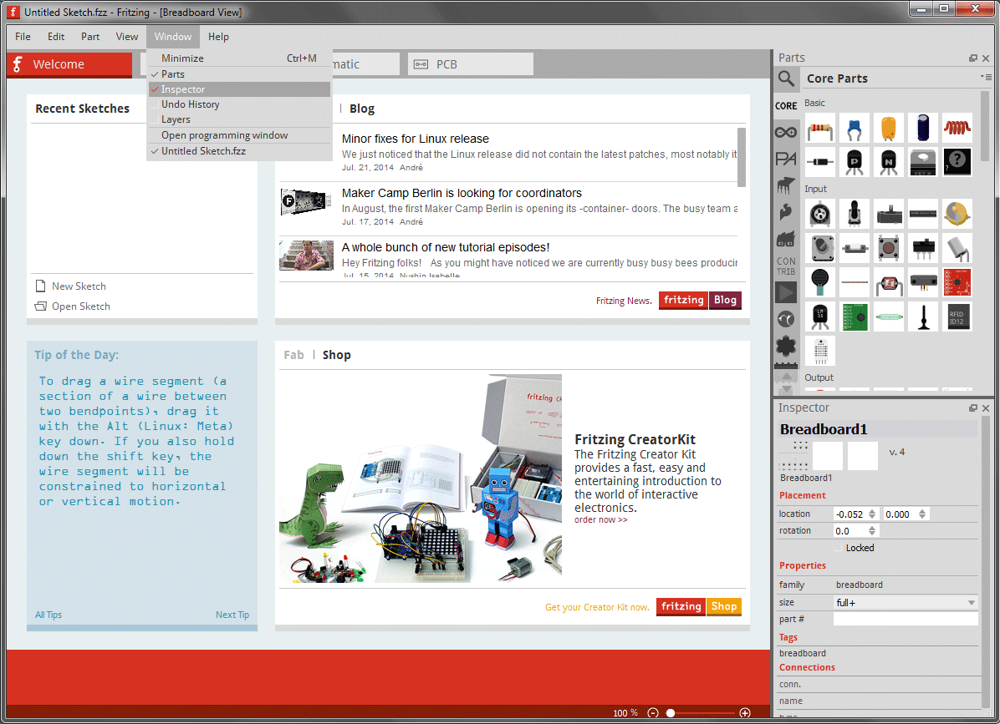
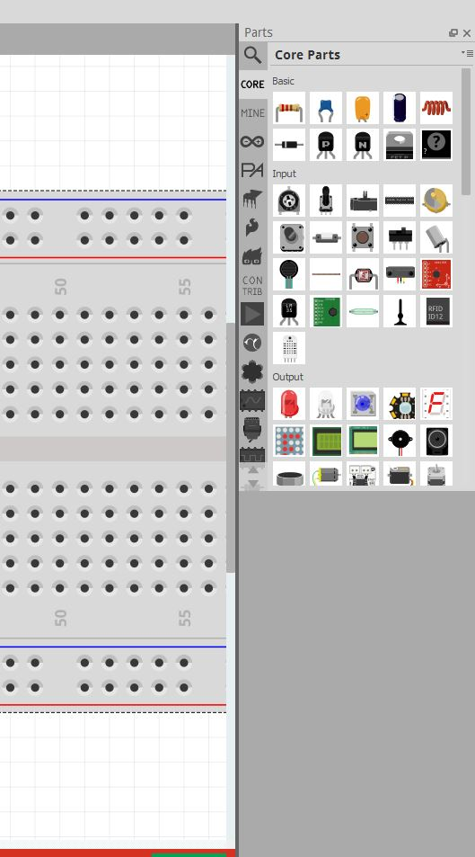
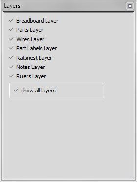

## Palettes and Arranging the environement

Palettes in fritzing are usefull little windows that can be docked to the right of the fritzing main window. so you can easily change the palettes you want to have during the design process to your needs.
So before you start working, you might want to arrange the environment according to our needs and preferences.

1. From the Fritzing Menu Bar, select Window > and mark the palette windows you would like to see in the environment.

2. Drag & drop palette windows to the right of the fritzing-window and notice how palettes rearrange, combine or float.

### Partpalette

The Fritzing Part-palette is the place where you can find all fritzing-parts. you can choose from different librarys on the left oft the palette, and you have the possibility to look for parts with a full-text search. that means you can easily find parts via: name, footprint, family and any other properties a part can have. useing the search option is the fastest way to find out if a part exists in fritzing or not.

### Inspectorpalette

The Inspector palette is the second most important palette in fritzing. it provides all the information about a part e.g. it shows you the "x" and "y" position of the part and its rotation. futerhmore this palette is usefull to change various attributes for the component you you have chosen.

### Undopalette

The Undopalette shows the lasts steps you have done during the design process. so you can easily go back in you workprocess. 

### Layerspalette

fritzing comes with diffrent layers in the three views. The Layers-palette gives you an overview what layers exists and the possibility to hide layers during the design process. If you uncheck a layer it will be hidden for the view.

**But watch out:** hidding a layer mean just hide it for the moment in fritzing. it does not effect the export to another file format. 

